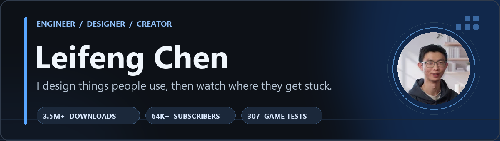

  

  
  
  

I started making Minecraft maps for my best friend. Today I'm a computer science student at **UC Santa Barbara**, building mobile apps, games, and the tools behind them. I care about clear systems, useful interfaces, and what real users do when my first design doesn't work.

### Currently

- **Daily Nexus:** working on the campus newspaper's native iOS and Android apps in Swift and Kotlin.
- **Hedron³:** co-founder building the marketing site and helping shape the product's UI/UX.

### Selected work

- **[Warden Creations](https://redstoneweewee.github.io/warden-creations.html)** · Hand-written Minecraft Bedrock add-ons with **3.5M+ downloads**; a 6,000+ member community helps shape updates.
- **[Uncoded Resolve](https://redstoneweewee.github.io/uncoded-resolve.html)** · A simultaneous-turn tactics game: systems and UI design, with a development process backed by **307 automated tests**.
- **[Eezy Receipt](https://redstoneweewee.github.io/eezy-receipt.html)** · A receipt-splitting app built with a seven-person team in React Native, Expo, and Supabase.
- **[Cable Conundrum](https://github.com/Redstoneweewee/Cable-Conundrum)** · A Unity puzzle game whose C# gameplay, shaders, art, and UI I made myself.

### Tools I use

### The full story

My portfolio has an interactive **Ask me** page, a browsable project grid, and case studies about the decisions and fixes behind the work.

<a href="https://redstoneweewee.github.io/">Open the portfolio →</a> · <a href="https://redstoneweewee.github.io/work.html">Browse case studies</a> · <a href="https://www.youtube.com/@warden-creations">Warden Creations on YouTube</a>

<!-- Layout inspiration: https://github.com/abhisheknaiidu/awesome-github-profile-readme -->
