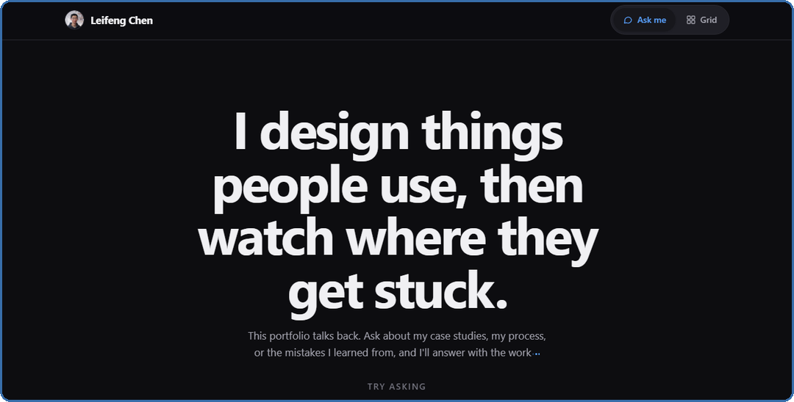

<h1 align="center">Hi, I'm Leifeng Chen 👋</h1>

<strong>Software engineer · game maker · designer · creator</strong> I design things people use, then watch where they get stuck.

  
  
  
  

  
  

  
  
  
  

---

I started making Minecraft maps for my best friend. Today I'm a computer science student at **UC Santa Barbara**, building mobile apps, games, and the tools behind them. I care about clear systems, useful interfaces, and what real users do when my first design doesn't work.

### Currently

- **Daily Nexus:** working on the campus newspaper's native iOS and Android apps in Swift and Kotlin.
- **Hedron³:** co-founder building the marketing site and helping shape the product's UI/UX.

### Selected work

 Hand-written Minecraft Bedrock add-ons with <strong>3.5M+ downloads</strong>; a 6,000+ member community helps shape updates.

 A simultaneous-turn tactics game: systems and UI design, with a development process backed by <strong>307 automated tests</strong>.

 A receipt-splitting app built with a seven-person team in React Native, Expo, and Supabase.

   A Unity puzzle game whose C# gameplay, shaders, art, and UI I made myself.

 A guided logistics-document workflow, responsive marketing site, and brand for the startup I co-founded.

### Tools I use

**Languages & web basics**

**Apps, frameworks & developer workflow**

**Games, testing & AI**

**Design, 3D & media**

### The full story

My portfolio has an interactive **Ask me** page, a browsable project grid, and case studies about the decisions and fixes behind the work. Click the preview to explore it.

<!-- Layout inspiration: https://github.com/abhisheknaiidu/awesome-github-profile-readme -->
