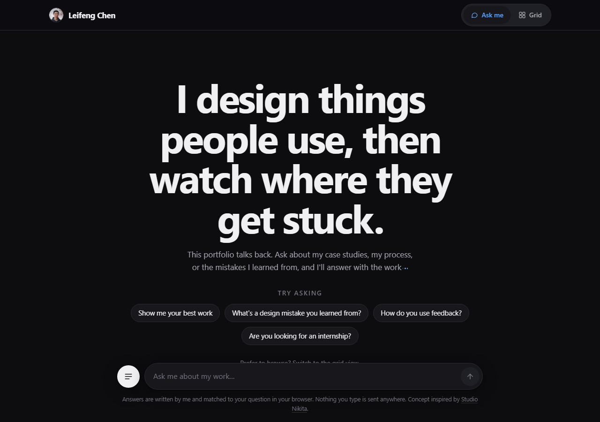

# Hi, I'm Leifeng Chen 👋

I'm a computer science student at UC Santa Barbara who likes building software people actually use. I started with Minecraft maps for my best friend. That became hand-written Bedrock add-ons, game systems, mobile apps, and a lot of lessons from the people using them.

**These days:** I work on the Daily Nexus's native mobile apps, co-founded Hedron³ and built its marketing site, and keep exploring the space between engineering and design.

### A few things I've made

| Project | What I did |
| --- | --- |
| [Warden Creations](https://redstoneweewee.github.io/warden-creations.html) | Built Minecraft add-ons with hand-written JavaScript/TypeScript and iterated with a 6,000+ member community. The add-ons have 3.5M+ downloads. |
| [Uncoded Resolve](https://redstoneweewee.github.io/uncoded-resolve.html) | Designed a simultaneous-turn tactics game, its UI and systems architecture, and a development process backed by 307 automated tests. |
| [Eezy Receipt](https://redstoneweewee.github.io/eezy-receipt.html) | Helped lead a seven-person team building a receipt-splitting app with React Native, Expo, and Supabase. |
| [Cable Conundrum](https://github.com/Redstoneweewee/Cable-Conundrum) | Designed and hand-coded a Unity puzzle game in C#, including its cable mechanics, shaders, and UI. |

### Explore my portfolio

The site has interactive questions, a browsable grid, and detailed case studies. Click the preview to open it.

**[Visit the website →](https://redstoneweewee.github.io/)** · [Browse case studies](https://redstoneweewee.github.io/work.html)

### Elsewhere

[LinkedIn](https://www.linkedin.com/in/leifengchen) · [YouTube / Warden Creations](https://www.youtube.com/@warden-creations) · [Email](mailto:leifengchen123@gmail.com)
